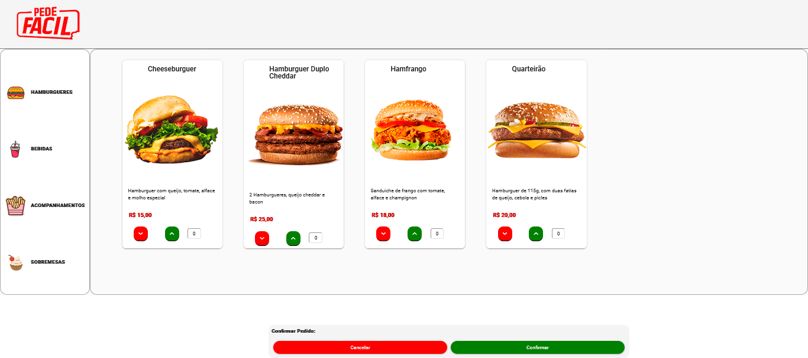
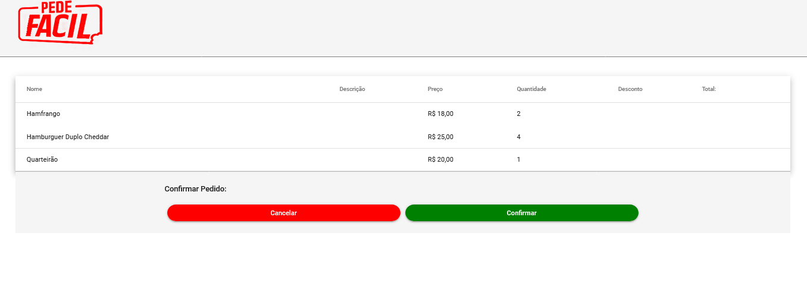
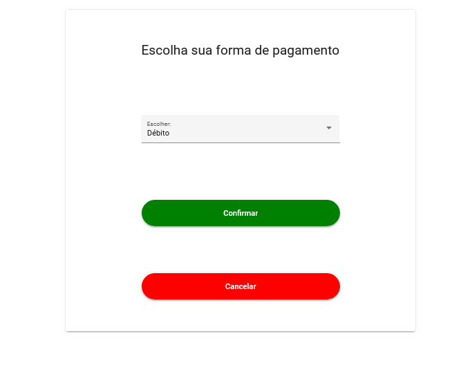

## Projeto Pedefacil
Simulando um sistema de totem de pedidos de uma rede de fastFood

## Integrantes
Gabriel Ferraro 
Athos Matovani

## Rodar webApi

npm start em ServidorAPIs

## Homepage

## Carrinho

## Confirmar Compra

## Conteúdos

- API desenvolvida em C#
- WebServer Angular
- Visual com Angular Material
- Base de dados SQL server

### 1 Comandos para criação do projeto Web API
dotnet new webapi -o PedeFacil 
cd PedeFacil 
dotnet restore 
### 2 Comandos para instalação do EntityFramework
dotnet add package Microsoft.EntityFrameworkCore 
dotnet add package Microsoft.EntityFrameworkCore.SqlServer 
dotnet add package Microsoft.EntityFrameworkCore.Design 
### 3 Comandos para geração do banco de dados
dotnet tool install --global dotnet-ef 
dotnet ef migrations add Initial 
dotnet ef database update 
### 4 Comandos para geração automática de WebAPIs
dotnet tool install -g dotnet-aspnet-codegenerator 
dotnet add package Microsoft.VisualStudio.Web.CodeGeneration.Design 
dotnet-aspnet-codegenerator controller -name UsuarioController -m Usuario -dc PediPDVContext -api --relativeFolderPath Controllers 
### 5 Comandos para instalação dos pacotes JWT
dotnet add package Microsoft.AspNetCore.Authentication 
dotnet add package Microsoft.AspNetCore.Authentication.JwtBearer 
dotnet add package BCrypt.Net-Next 
### 6 Comando para execução da aplicação
dotnet watch run 
